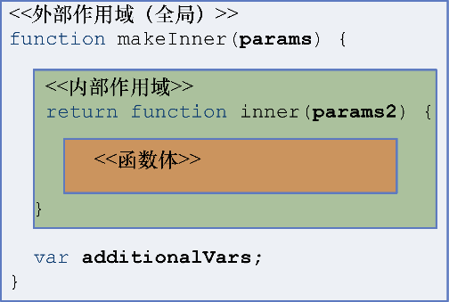

# 闭包和作用域

> **闭包**是一种能够在函数声明过程中将环境信息与所属函数绑定在一起的数据结构。它是基于函数声明的文本位置的，因此也被称为围绕函数定义的**静态作用域**或**词法作用域**。闭包能够使函数访问其环境状态，使得代码更清晰可读。你很快就会看到，闭包不仅应用于函数式编程的高阶函数中，也可用于事件处理和回调、模拟私有成员变量，还能用于弥补一些 JavaScript 的不足。
>
> 支配函数闭包行为的规则与 JavaScript 的作用域规则密切相关。作用域能够将一组变量绑定，并定义变量定义的代码段。从本质上讲，闭包就是函数继承而来的作用域，这类似于对象方法是如何访问其继承的实例变量的，它们都具有其父类型的引用。在内嵌函数中能够很清楚地看到闭包

```text
// 看两个闭包例子
function makeAddFunction(amount) {
  function add(number) { ⇽--- add函数可以通过词法绑定访问到amount变量
      return number + amount;
   }
   return add;
}
function makeExponentialFunction(base) {
   function raise (exponent) { ⇽--- raise()函数也可以通过词法绑定访问到base
     return Math.pow(base, exponent);
   }
   return raise;
}
var addTenTo = makeAddFunction(10);
addTenTo(10); //-> 20
var raiseThreeTo = makeExponentialFunction(3);
raiseThreeTo(2); //-> 9
```



闭包包含了在外部（全局）作用域中声明的变量、在父函数内部作用域中声明的变量、父函数的参数以及在函数声明之后声明的变量。函数体中的代码可以访问这些作用域中定义的变量和对象。而所有函数都共享全局作用域

再来看一个实战  &gt; 形成闭包的原因是GC 机制,这个基础略过

```text
var outerVar = 'Outer';  ⇽---声明全局变量outerVar
function makeInner(params) {
  var innerVar = 'Inner';  ⇽---调用makeInner会得到inner函数
  function inner() {
      console.log( ⇽---声明inner：innerVar和outerVar在inner闭包内
       `I can see: ${outerVar}, ${innerVar}, and ${params}`);
   }
   return inner;
}
var inner = makeInner('Params'); ⇽---声明局部变量makeInner
inner(); ⇽---函数inner生命周期比外部函数还长
```

## 全局作用域\( 略\)

## 函数作用域\(略\)

## 伪块作用域

## 闭包实际应用

