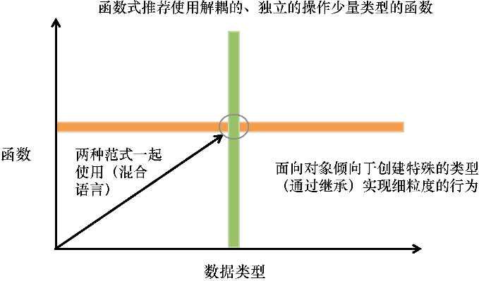

# 函数式与面向对象



## 管理JavaScript对象的状态


## 将对象视为数值

```text
function coordinate(lat, long) {
   let _lat = lat;
   let _long = long;
   return {
      latitude: function () {
         return _lat;
      },
      longitude: function () {
         return _long;
     },
      translate: function (dx, dy) {
         return coordinate(_lat + dx, _long + dy);  ⇽---返回翻译过的坐标副本
      },
      toString: function () {
         return '(' + _lat + ',' + _long + ')';
      }
   };
}
const greenwich = coordinate(51.4778, 0.0015);
greenwich.toString(); //-> '(51.4778, 0.0015)'
```


 让方法返回一个新的副本（例如 `translate`）是另一种实现不可变性的方式。在该对象上应用**一次平移操作**，将产生一个新的 `coordinate` 对象：

`greenwich.translate(10, 10).toString(); //-> '(61.4778, 10.0015)'`


## 深冻结可变部分


```
Object.freeze(obj) 冻结对象,只能浅冻结,里面的子结构的对象不能冻结
Object.isFrozen(obj) 是否冻结对象
```


```text
var isObject = (val) => val && typeof val === 'object';

function deepFreeze(obj) {
  if (isObject(obj)  //遍历所有属性并递归调用Object.freeze()（使用第3章介绍的map）
    && !Object.isFrozen(obj)) { //跳过已经冻结过的对象，冻结没有被冻结过的对象
    Object.keys(obj).// 遍历属性;跳过所有的函数，即使从技术上说，函数也可以被修改，但是我们更希望注意在数据的属性上
    forEach(name => deepFreeze(obj[name]));  //递归地自调用（第3章会介绍递归）
    Object.freeze(obj);  //冻结根对象//连续调用里面的子属性
  }
  return obj;
}

```

## 使用Lenses定位并修改对象图

 可以使用一个称为 [Ramda.js](http://ramda.cn/docs/) 的函数式,入门很简单对着文档很快就知道了

```text
var xLens = R.lensProp('x');

R.view(xLens, {x: 1, y: 2});            //=> 1
R.set(xLens, 4, {x: 1, y: 2});          //=> {x: 4, y: 2}
R.over(xLens, R.negate, {x: 1, y: 2});  //=> {x: -1, y: 2}
```


