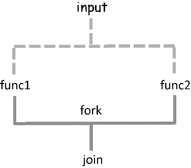

# 使用函数组合子来管理程序的控制流

## identity（I-combinator）

 组合子是返回与参数同值的函数 ;它广泛使用于函数数学特性的检验，但也有很多其他的实际用途

## tap（K-组合子）


`tap` 非常有用，它能够将无返回值的函数（例如记录日志、修改文件或HTML页面的函数）嵌入函数组合中，而无须创建其他的代码

我的理解: 将一个值传入指定函数，并返回该值。


```text
//官方实例
var sayX = x => console.log('x is ' + x);
R.tap(sayX)(100) // 100
```

```text
//应用实例
const debugLog = _.partial(logger, 'console', 'basic', 'MyLogger','DEBUG');

const debug = R.tap(debugLog);
const cleanInput = R.compose(normalize, debug, trim);
const isValidSsn = R.compose(debug, checkLengthSsn, debug, cleanInput);
```

## alt（OR-组合子）

 组合子能够在提供函数响应的默认行为时执行简单的条件逻辑。该组合器以两个函数为参数，如果第一个函数返回值已定义（即，不是`false`、`null`或`undefined`），则返回该值；否则，返回第二个函数的结果。可以按照如下方式实现：

```javascript
const alt = function (func1, func2) {
    return function (val) {
       return func1(val) || func2(val);
    }
};
```

```text
// 可以使用curry和lambda表达式写得更简洁：

const alt = R.curry((func1, func2, val) => func1(val) || func2(val))
```

## seq（S-组合子）

 组合子用于遍历函数序列。它以两个或更多的函数作为参数并返回一个新的函数，会用相同的值顺序调用所有这些函数。该组合子的实现如下：

```text
const seq = function(/*funcs*/) {
    const funcs = Array.prototype.slice.call(arguments);
    return function (val) {
       funcs.forEach(function (fn) {
          fn(val);
       });
    };
};
```

 组合子不会返回任何值，只会一个一个地执行一系列操作。如果要将其嵌入函数组合之间，可以使用`R.tap`将它与其余部分进行桥接。

## fork（join）组合子

 `fork`组合子用于需要以两种不同的方式处理单个资源的情况。该组合子需要以3个函数作为参数，即以一个join函数和两个fork函数来处理提供的输入。两个分叉函数的结果最终传递到的接收两个参数的`join`函数中



```text
const fork = function(join, func1, func2){
   return function(val) {
      return join(func1(val), func2(val));
   };
};
```

```text
const computeAverageGrade =
    R.compose(getLetterGrade, fork(R.divide, R.sum, R.length));
computeAverageGrade([99, 80, 89]);
```

有些人将组合视为约束，但看来恰恰相反：组合子使代码编写更加灵活，并有利于point-free风格编程。因为组合子都是纯函数，它们也能够结合其他组合子使用，为任何类型的应用程序提供无数的替代方案并减少复杂度。我们会在后续章节中再次使用它们。

基于不可变性和纯性，函数式编程可以有效提高程序代码的模块化和可重用性水平。在第2章中，我们了解到JavaScript中的函数也可以模块化。同理，也可以像使用函数一样组合和重用整个模块。这一内容留待读者独立思考。

模块化的函数式程序由一些抽象的函数构成，可以单独地理解并重用，其功能与组合的具体规则相关。在本章中，我们了解到纯函数的组合是函数式编程的支柱。这些组合技术均利用了函数式抽象的特性，（通过柯里化或部分应用）对各种纯函数进行组合


## 总结

* 用于连接可重用的、模块化的、组件化程序的函数链与管道。
* Ramda.js是一个功能强大的函数库，适用于函数的柯里化与组合。
* 可以通过部分求值和柯里化来减少函数元数，利用对参数子集的部分求值将函数转化为一元函数。
* 可以将任务分解为多个简单的函数，再通过组合来获得整个解决方案。
* 以point-free的风格编写，并用函数组合子来组织的程序控制流，可解决现实问题。

