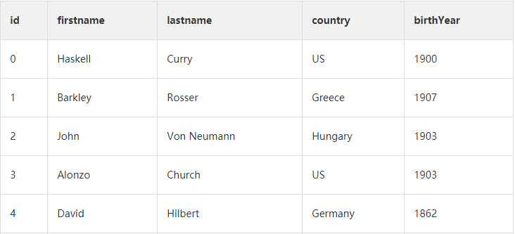

# 代码推理

## 声明式惰性计算函数链

函数通过不断链式调用,直到最后才去执行

```text
_.chain(persons) ⇽--- 创建惰性计算函数链来处理给定的数组
    .filter(isValid)
   .map(_.property('address.country')) 
   //⇽--- 使用 _.property 抽取 person 对象的address.country 属性。这是 Ramda 的R.view() 的 Lodash 对应版本，虽然Lodash 的版本没有那么功能丰富
    .reduce(gatherStats, {})
    .values()
    .sortBy('count')
    .reverse()
    .first()
    .value() ⇽--- 执行函数链中的所有函数
    .name; //-> 'US'
```

 使用 `_.chain` 的另一个好处是可以创建具有惰性计算能力的复杂程序，在调用 `value()` 前，并不会真正地执行任何操作。这可能会对程序产生巨大的影响，因为在不需要其结果的情况下，可以跳过运行所有函数; ladash可以\_.chain 和value可以是实现惰性计算函数

## 类SQL的数据：函数即数据



```text
SQL:查询这个语句
SELECT p.firstname, p.birthYear FROM Person p
WHERE p.birthYear > 1903 and p.country IS NOT 'US'
GROUP BY p.firstname, p.birthYear
```

```text
// Lodash支持一种称为mixins的功能，可以用来为核心库扩展新的函数
_.mixin({'select':  _.pluck,
         'from':    _.chain,
         'where':   _.filter,
         'groupBy': _.sortByOrder});
```

```text
// 编写类似 SQL 的 JavaScript 代码
_.from(persons)
  .where(p => p.birthYear > 1900 && p.address.country !== 'US')
  .groupBy(['firstname', 'birthYear'])
  .select('firstname', 'birthYear')
  .value();
```

