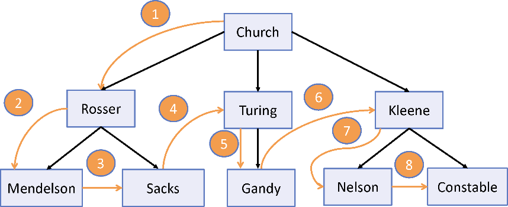

# 递归地思考

## 什么是递归？

 递归是一种旨在通过将问题分解成较小的自相似问题来解决问题本身的技术，将这些小的自相似问题结合在一起，就可以得到最终的解决方案。递归函数包含以下两个主要部分。

* 基例\(终止条件\)
* 递归条件

## 学会递归地思考

 递归不是一个容易掌握的概念。与函数式编程一样，最难的部分是忘记常规的方法。

```text
_(nums).reduce((acc, current) => acc + current, 0);
```

 递归和迭代是一枚硬币的两面。在不可变的条件下，递归提供了一种更具表现力、强大且优秀的迭代替代方法。事实上，纯函数式语言甚至没有标准的循环结构，如 `do`、`for` 和 `while`，因为所有循环都是递归完成的。递归使代码更易理解，因为它是以多次在较小的输入上重复相同的操作为基础的。

## 递归定义的数据结构

### 递归定义的数据结构

```text
class Tree {
   constructor(root) {
      this._root = root;
   }
   static map(node, fn, tree = null) { ⇽--- 使用静态方法以免与Array.prototype.map 混淆。静态方法也能像单例函数一样高效
      node.value = fn(node.value); ⇽--- 调用遍历器函数，并更新树中的节点值
      if(tree === null) {
           tree = new Tree(node); ⇽--- 与 Array.prototype.map 类似。结果是一个新的结构
      }
      if(node.hasChildren()) { ⇽--- 如果节点没有孩子，则返回（基例）
        _.map(node.children, function (child) { ⇽--- 将函数应用到每一个孩子节点
            Tree.map(child, fn, tree); ⇽--- 递归地调用每一个孩子节点
        });
      }
      return tree;
   }
   get root() {
      return this._root;
   }
}
/*
节点的主要逻辑在于 append 方法。
要给一个节点追加一个子节点，需要将该节点设置为子节点的 parent 引用，并把子节点添加至该节点的子节点列表中。
通过从根部不断地将节点链接到其他子节点来填充一棵树，由 church 开始：
*/
church.append(rosser).append(turing).append(kleene);
kleene.append(nelson).append(constable);
rosser.append(mendelson).append(sacks);
turing.append(gandy);
```



## 总结

* 使用map、reduce和filter等高阶函数来编写高可扩展的代码。 
* 使用Lodash进行数据处理，通过控制链创建控制流与数据变换明确分离的程序。
*  使用声明式的函数式编程能够构建出更易理解的程序。
*  将高阶抽象映射到SQL语句，从而深刻地认识数据。 
* 递归能够解决自相似问题，并解析递归定义的数据结构。

