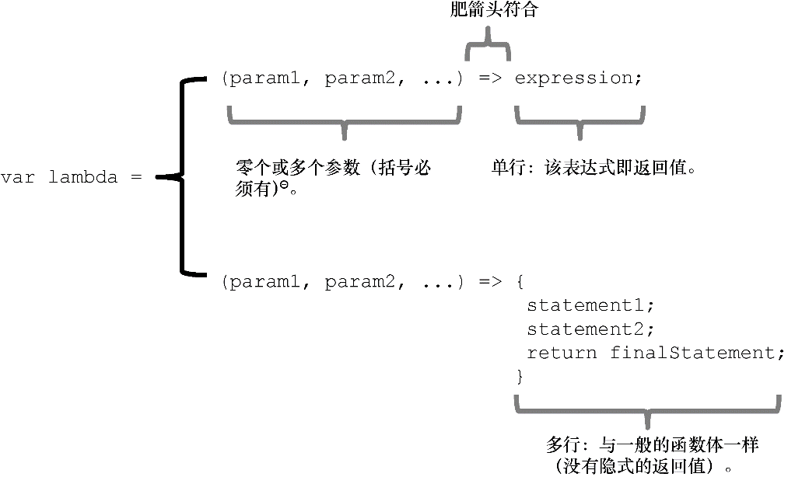

# 理解程序的控制流

## 理解程序的控制流


 采用这种链式操作能够使程序简洁、流畅并富有表现力，能够从计算逻辑中很好地分离控制流，因此可以使得代码和数据更易推理。


```text
optA().optB().optC().optD();
//这样用点连接表示有共同的对象上定义过这些方法
```

## 链接方法


 **方法链**是一种能够在一个语句中调用多个方法的面向对象编程模式。当这些方法属于同一个对象时，方法链又称为**方法级联**。尽管该模式大多出现在面向对象的应用程序中，但在一些特定条件下，如操作不可变对象时，也能很好地用于函数式编程中。


```text
// 让我们来看一个字符串处理的例子
'Functional Programming'.substring(0, 10).toLowerCase() + ' is fun';
```

```text
// 如果用更加函数式的风格重构上面的代码，它会像这样：
// concat(toLowerCase(substring('Functional Programming', 1, 10))),' is fun');
```

## 函数链

### 了解lambda表达式




 **lambda表达式**（在JavaScript中也被称为**箭头函数**）源自函数式编程，比起传统的函数声明，它可以采用相对简洁的语法形式来声明一个匿名函数。


### 用\_.map做数据变换

```text
_.map(persons,
    s => (s !== null && s !== undefined) ? s.fullname : '' ⇽--- 通过高阶函数去掉了所有var声明
);
```

```javascript
// map函数的实现
function map(arr, fn) {      ⇽--- 接收一个函数和一个数组，应用函数到数组中的每一个元素，然后返回同样大小的新数组
  let idx    = 0,
       len    = arr.length,
       result = new Array(len);      ⇽--- 结果：一个与输入数组同样长度的数组
   while (++idx < len) {
       result[index] = fn(array[idx], idx, arr);      ⇽--- 应用函数fn到数组中的每一个元素，再把结果放入数组
   }
   return result;
}
```

### 用\_.reduce 收集结果

 高阶函数`reduce`将一个数组中的元素精简为单一的值。该值是由每个元素与一个累积值通过一个函数计算得出的，如图3.5所示。


```text
reduce(f,[e0, e1, e2, e3],accum) -> f(f(f(f(acc, e0), e1, e2, e3)))) -> R
```

```text
// reduce的实现
// fn——迭代函数
// accumulator---累加器
function reduce(arr, fn,[accumulator]) {
   let idx = -1,
       len = arr.length;
   if (!accumulator &amp;&amp; len > 0) {      ⇽--- 如果不提供累加值，就会用第一个元素作为累加值
      accumulator = arr[++idx];
   }
  while (++idx < len) {
      accumulator = fn(accumulator,      ⇽--- 应用fn到每一个元素，将结果放到累加值中
      arr[idx], idx, arr);
   }
   return accumulator;      ⇽--- 返回累加值
}
```

看一个案例   **国家人数计算**

```text
_(persons).reduce(function (stat, person) {
    const country = person.address.country; ⇽--- 抽取国家信息
   stat[country] = _.isUndefined(stat[country]) ? 1 : ⇽--- 记录人数， 初始为 1，每当找到同样国家的同学则加 1
         stat[country] + 1;
   return stat; ⇽---  返回累加值
}, {}); ⇽--- 以空对象作为初始累加器

// 这段代码能够将输入的数组转换为表征各国人数的单一对象：
{
    'US'     : 2,
    'Greece' : 1,
    'Hungary': 1
}
```

 为进一步简化，可以使用普适的 `map-reduce` 组合。通过链接这些函数，并提供具有特定行为的函数参数，就可以提高 `map`和 `reduce` 函数的威力。抽象地讲，该程序流将具有如下结构：

```text
// _(persons).map(func1).reduce(func2);

const getCountry = person => person.address.country;
const gatherStats = function (stat, criteria) {
   stat[criteria] = _.isUndefined(stat[criteria]) ? 1 :
       stat[criteria] + 1;
   return stat;
};
_(persons).map(getCountry).reduce(gatherStats, {});
//使用 map 将对象数组进行预处理，提取出所有国家信息。
//之后，再使用 reduce 来收集最终的结果。
```

### 用\_.filter 删除不需要的元素

> 在处理较大的数据集合时，往往需要删除部分不能参与计算的元素。例如，需要计算只生活在欧洲国家的人或是出生在某一年的人。与其在代码中到处用 `if-else` 语句，不如用 `_.filter` 来实现。


```text
//filter的实现
function filter(arr, predicate) {
   let idx = -1,
       len = arr.length,
       result = []; ⇽--- 结果数组为原数组的子集
   while (++idx < len) {
     let value = arr[idx];
    if (predicate(value, idx, this)) { ⇽--- 调用谓词函数，如果结果为真，则保留，否则略过
       result.push(value);
     }
   }
   return result;
}
```

扩展一下数组扩展式

```text
[for (p of people) if (p.birthYear ===  1903) p.fullname].join(' and ');
现在好像是废除了
```

